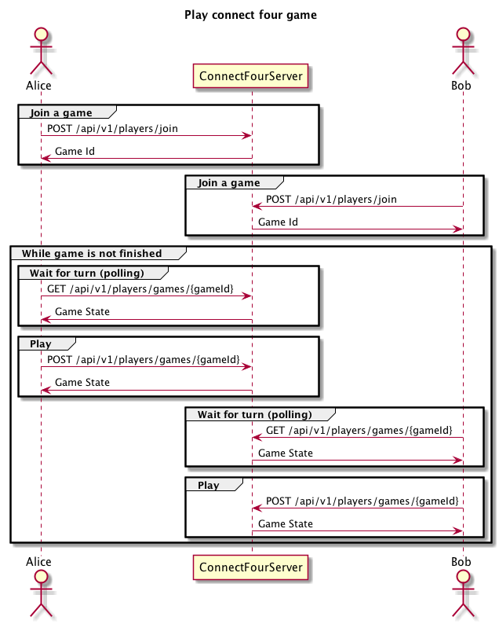

# Connect Four Challenge Server [](https://travis-ci.org/lakermann/connect-four-challenge-server)

_by [Lukas Akermann](https://github.com/lakermann), October 2018_

This is a Java server for the [connect four challenge](https://github.com/lakermann/connect-four-challenge).

## Getting started

Download and extract the latest [release](https://github.com/lakermann/connect-four-challenge-server/releases).

Start the server inside a [docker](https://www.docker.com/) container:

```bash
docker-compose up
```

Start the server without docker:

```bash
java -jar connect-four-challenge-server.jar
```

Open [http://localhost:8080](http://localhost:8080) in your browser.

### Profiles

There are two profiles to alter the behaviour of the server:

* `default`

  Each game must be scheduled via the user interface.
  
  The response to the player is delayed by 3 seconds after the game has ended.

* `train`

  The games are scheduled automatically.
  
  Immediate response after the game has ended.
  
Use the `train` profile with docker:

```bash
docker-compose -f docker-compose.train.yml up
```

Use the `train` profile without docker:

```bash
java -Dspring.profiles.active=train -jar connect-four-challenge-server.jar
```

## Player API

The whole communication ist REST based. For more details about REST have a look at the following documentation:

* <https://en.wikipedia.org/wiki/REST>

## Overview over the available endpoints

| Endpoint                              | Description                                            | Link                    |
| ------------------------------------- | ------------------------------------------------------ | ----------------------- |
| `POST /api/v1/players/join`           | Join a game and get a game id                          | [Details](#join-a-game) |
| `GET  /api/v1/players/games/{gameId}` | Get the current game state                             | [Details](#get-a-game)  |
| `POST /api/v1/players/games/{gameId}` | Drop a disc in a column and get the current game state | [Details](#drop-a-disc) |

### Join a game

Join a scheduled game (you can't join multiple games at the same time).

#### Join Request

HTTP POST to `/api/v1/players/join`.

```json
{
  "playerId": "<Alice>"
}
```

| value    | description      |
| -------- | ---------------- |
| playerId | unique player id |

#### Join Response

No game scheduled:

```json
{}
```

Scheduled game:

```json
{
  "gameId": "80dfa415-fbdf-451e-803e-0b9928bd6821"
}
```

### Get a Game

Receive the state of a running or finished game.

#### Game Request

HTTP GET to `/api/v1/players/games/{gameId}`.

#### Game Response

The current [game state](#game-state).

### Drop a disc

Drop a disc in a column.

#### Drop Disc Request

HTTP POST to `/api/v1/players/games/{gameId}`.

```json
{
  "playerId": "Alice",
  "column": 1
}
 ```

| value    | description                             |
| -------- | --------------------------------------- |
| playerId | unique player id                        |
| column   | column number, first column is column 1 |

#### Drop Disc Response

The current [game state](#game-state).

### Game State

```json
{
  "currentPlayerId": "Bob",
  "players": [
      {
        "playerId": "Alice",
        "disc": "RED"
      },
      {
        "playerId": "Bob",
        "disc": "YELLOW"
      }
  ],
  "board": [
    ["EMPTY","EMPTY","EMPTY","EMPTY","EMPTY","EMPTY","EMPTY"],
    ["EMPTY","EMPTY","EMPTY","EMPTY","EMPTY","EMPTY","EMPTY"],
    ["EMPTY","EMPTY","EMPTY","EMPTY","EMPTY","EMPTY","EMPTY"],
    ["EMPTY","EMPTY","EMPTY","EMPTY","EMPTY","EMPTY","EMPTY"],
    ["EMPTY","EMPTY","EMPTY","EMPTY","EMPTY","EMPTY","EMPTY"],
    ["EMPTY","RED",  "EMPTY","EMPTY","EMPTY","EMPTY","EMPTY"]
  ],
  "finished": false
}
```

| value               | description                                             |
| ------------------- | ------------------------------------------------------- |
| currentPlayerId     | current player id                                       |
| players[0].playerId | first player id                                         |
| players[0].disc     | first player disc color, RED or YELLOW                  |
| players[1].playerId | second player id                                        |
| players[1].disc     | second player disc color, RED or YELLOW                 |
| board               | list of cells, EMPTY, RED or YELLOW                     |
| finished            | true = game is finished, false = game is running        |
| winner              | null = game is running or draw, player id = game winner |

## Sequence of a game

